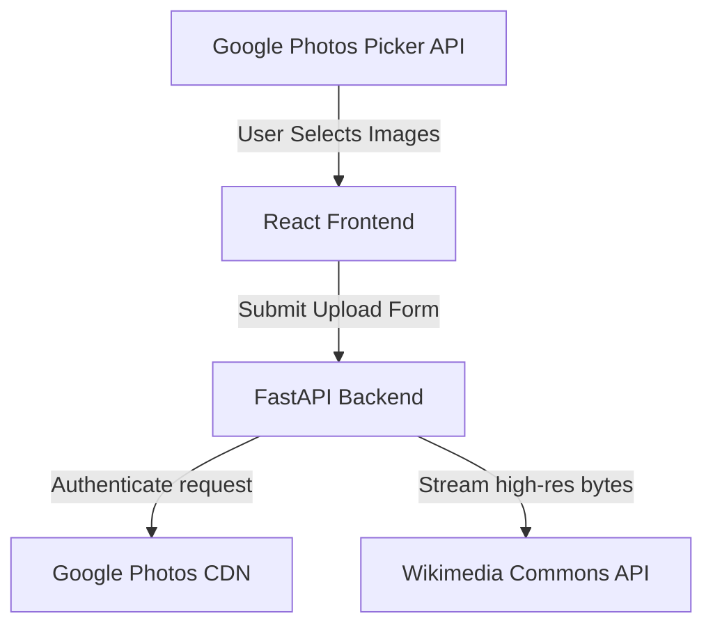

# Google Photos to Wikimedia Commons Bridge

A modern, secure web application to transfer curated photos from Google Photos directly to Wikimedia Commons using official APIs. It provides a clean, visual curation interface to rename files, add multilingual descriptions, assign categories, and publish uploads asynchronously in chunks.

## Architecture & Features



### 1. Secure & Scoped Google Photos Access
* Uses the **Google Photos Picker API** (OAuth scope: `.../auth/photospicker.mediaitems.readonly`).
* Uses a **Session-based Picker Flow**: The application never gains broad access to the user's entire library. It only accesses items explicitly selected and returned by the picker popup.

### 2. Live Curation & Metadata Editing
* **Multilingual Description & Caption**: Edit descriptions in languages supported by Wikimedia.
* **Auto-populated Date**: Extracted from the original image EXIF data (`createTime` retrieved from Google Photos metadata).
* **Category Autocomplete**: Directly integrates with the MediaWiki OpenSearch API to search and validate categories.
* **Smart Filename Suggestions**: Suggests standard, descriptive names for Wikimedia Commons.

### 3. Asynchronous Chunked Uploads
* Streams photo bytes in memory using async HTTP generators (`httpx.AsyncClient.stream`).
* **Zero temporary disk storage**: Bytes are downloaded and chunk-uploaded to MediaWiki concurrently to prevent memory leaks and protect user privacy.
* **Bypasses Soft Warnings**: Finalizes stashed uploads with `ignorewarnings: 1` to bypass minor filename or duplicate alerts.
* **Progress Tracking**: Real-time progress bar powered by background worker polling.

---

## Technical Stack

* **Frontend**: React 19, TypeScript, Vite, TailwindCSS (Vanilla variables styling)
* **Backend**: FastAPI, Python 3.12+, SQL Alchemy, SQLite (sessions persistence), HTTPX (asynchronous stream processing)

---

## Directory Structure

```
├── backend/
│   ├── app/
│   │   ├── models/        # Database session models
│   │   ├── routers/       # Endpoints: auth, picker, upload
│   │   └── services/      # Client wrappers for MediaWiki & Google Photos
│   └── run.py             # FastAPI Server Entrypoint
├── frontend/
│   ├── src/
│   │   ├── components/    # Picker, MetadataEditor, Dashboard
│   │   └── utils/         # API Client wrappers
│   └── index.html
├── run.sh                 # Entrypoint shell script to boot frontend + backend
└── LICENSE
```

---

## Setup & Execution

### Prerequisites
* Python 3.10+
* Node.js 18+
* Google Cloud Console Credentials (with Photos Picker API enabled)
* Wikimedia Client Credentials (with OAuth 2.0 configured)

### Quick Start
1. Clone the repository.
2. Copy `.env.example` to `.env` and fill in your Client IDs and Secrets:
   ```bash
   cp .env.example .env
   ```
3. Run the development environment launcher:
   ```bash
   ./run.sh
   ```
4. Access the web app at `http://localhost:5173`.
